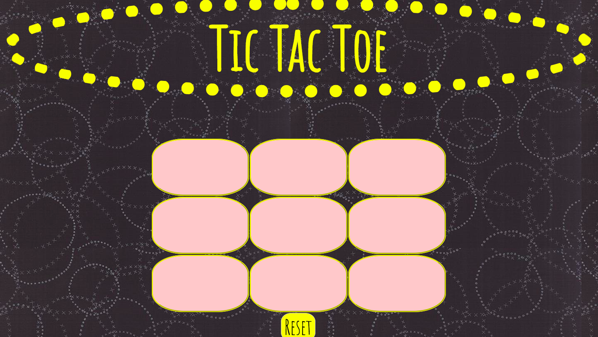

# Tic Tac Toe

The users should be able to click to place their X or O and if they win the program should mention their win in the DOM.

## link to live site:

https://thaistictactoe.netlify.com/

## how its made:

## Tech used: HTML,CSS, Javascript

I combined javascript function with a simple html layout. I need to come back and use object oriented programming.

## Lessons learned:
This was the first project that team Gardner worked together in. It was a great initial team building project.s
